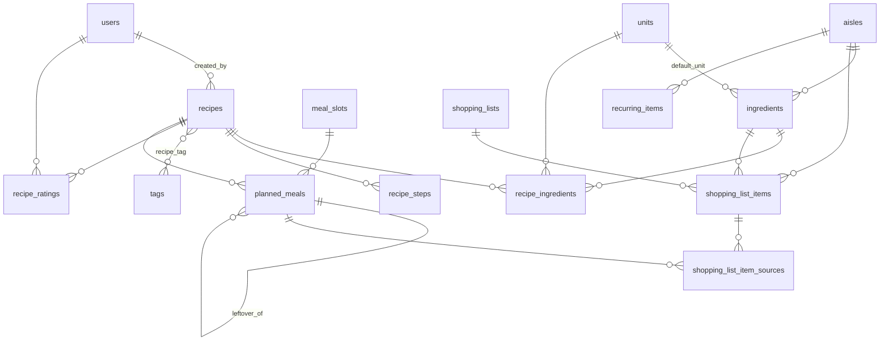

# 03 — Modèle de données

> Tables créées au lot 1 : `units`, `aisles`, `tags`, `meal_slots`, `ingredients`. Lot 2 : `recipes`, `recipe_ingredients`, `recipe_steps`, `recipe_tag`, `recipe_ratings`. Lot 3 : `planned_meals`. Lot 4 : `shopping_lists`, `shopping_list_items`, `shopping_list_item_sources`, `recurring_items`. Lot 6 : `guests`, `guest_restrictions`, `meal_occasions`, `meal_occasion_guest`. Lot 7 : `storage_locations`, `stock_items`, `stock_movements` (+ colonnes de stock sur `ingredients`, `stocked_at` sur `shopping_list_items`). Lot 8 : `settings`. Lot 9 : colonnes `deduct_stock` sur `shopping_lists` et `stock_status`, `stock_deducted`, `stock_note`, `buy_anyway` sur `shopping_list_items`, unité `portion`. Lot 11 : `ingredient_aliases`, `ingredient_merges`, colonnes `added_quantity` / `added_unit_id` sur `shopping_list_items`, `preferences` (JSON) sur `users`. Lot 12 : `recipe_cook_notes`. Lot 13 : colonnes `is_to_test` sur `recipes` et `group_name` sur `recipe_steps`. Lot 14 : `week_templates`, `week_template_meals`, `wishes`, `reminders`. Lot 15 : `household_restrictions`, `meal_reactions`, colonnes `cook_user_id` / `cook_together` sur `planned_meals`, `role` sur `users`. Tables prévues pour les lots 9 et 10 : voir [05-evolutions-convives-stock.md](05-evolutions-convives-stock.md#modèle-de-données-ajouts). Les enums sont stockés en `VARCHAR` (plus simple à faire évoluer qu'un `ENUM` SQL) et validés par des enums PHP.

Base : **MariaDB**, nom `bouffe`, jeu de caractères `utf8mb4`, collation `utf8mb4_unicode_ci`, moteur InnoDB.
Toutes les tables ont `id BIGINT UNSIGNED AUTO_INCREMENT` et `created_at` / `updated_at` (conventions Laravel), sauf mention contraire.
Les tables sont créées par **migrations Laravel** (jamais à la main dans phpMyAdmin).

## 1. Diagramme

## 2. Tables

### Référentiels

**`users`** — standard Laravel
| Colonne | Type | Notes |
|---|---|---|
| name | VARCHAR(100) | |
| email | VARCHAR(191) UNIQUE | |
| password | VARCHAR(255) | hash bcrypt/argon |
| remember_token | VARCHAR(100) NULL | |

**`units`**
| Colonne | Type | Notes |
|---|---|---|
| code | VARCHAR(20) UNIQUE | `g`, `kg`, `cs`, `piece`… |
| label | VARCHAR(50) | « c. à soupe » |
| label_plural | VARCHAR(50) NULL | « pièces » |
| type | VARCHAR(10) | enum PHP `App\Enums\UnitType` : mass, volume, piece, other |
| factor_to_base | DECIMAL(12,4) NULL | vers g (mass) ou ml (volume) ; NULL sinon |
| is_metric | BOOLEAN | g, kg, ml, cl, l : affichage normalisé (1 250 g → 1,25 kg) ; faux pour les cuillères |
| sort_order | SMALLINT | |

**`aisles`** (rayons)
| Colonne | Type | Notes |
|---|---|---|
| name | VARCHAR(100) UNIQUE | |
| sort_order | SMALLINT | ordre de parcours du magasin |
| color | VARCHAR(20) | clé de palette (`green`, `red`…) → `App\Support\Palette` |

**`ingredients`**
| Colonne | Type | Notes |
|---|---|---|
| name | VARCHAR(150) UNIQUE | |
| name_plural | VARCHAR(150) NULL | |
| search_name | VARCHAR(150) UNIQUE | nom normalisé (minuscules, sans accent, singulier) : recherche et anti-doublon |
| aisle_id | FK → aisles | RESTRICT |
| default_unit_id | FK → units NULL | SET NULL |
| piece_weight_g | DECIMAL(10,3) NULL | poids moyen d'une pièce |
| is_staple | BOOLEAN default 0 | produit de base (placard) |
| season_months | SET / JSON NULL | V2 |
| price_per_unit | DECIMAL(8,2) NULL | V2 |

**`tags`**
| Colonne | Type | Notes |
|---|---|---|
| name | VARCHAR(50) UNIQUE | |
| slug | VARCHAR(60) UNIQUE | calculé depuis le nom |
| color | VARCHAR(20) | clé de palette |

**`meal_slots`** (créneaux)
| Colonne | Type | Notes |
|---|---|---|
| name | VARCHAR(50) UNIQUE | Petit-déjeuner, Déjeuner, Goûter, Dîner |
| sort_order | SMALLINT | |
| is_active | BOOLEAN | |

### Recettes

**`recipes`**
| Colonne | Type | Notes |
|---|---|---|
| title | VARCHAR(200) UNIQUE | |
| slug | VARCHAR(220) UNIQUE | URL lisible |
| search_title | VARCHAR(200) INDEX | titre normalisé pour la recherche |
| description | TEXT NULL | |
| servings | TINYINT UNSIGNED | portions de base, défaut 2 |
| prep_minutes / cook_minutes / rest_minutes | SMALLINT UNSIGNED NULL | |
| difficulty | ENUM('easy','medium','hard') NULL | |
| photo_path | VARCHAR(255) NULL | base du nom dans `storage/app/private/recipes` (`…jpg` + `…-thumb.jpg`), servie par l'application aux utilisateurs connectés |
| source | VARCHAR(500) NULL | URL ou texte |
| notes | TEXT NULL | |
| is_favorite | BOOLEAN | |
| is_to_test | BOOLEAN INDEX | recette importée, jamais cuisinée (lot 13) |
| archived_at | TIMESTAMP NULL | archivage (≠ suppression) |
| created_by / updated_by | FK → users NULL | |
| INDEX FULLTEXT(title, description) | | recherche |

**`recipe_ingredients`**
| Colonne | Type | Notes |
|---|---|---|
| recipe_id | FK → recipes | CASCADE |
| ingredient_id | FK → ingredients | RESTRICT |
| quantity | DECIMAL(10,3) NULL | NULL = « à convenance » |
| unit_id | FK → units NULL | |
| preparation | VARCHAR(150) NULL | « émincé » |
| group_name | VARCHAR(80) NULL | « Pâte », « Garniture » |
| is_optional | BOOLEAN | |
| sort_order | SMALLINT | |

**`recipe_steps`**
| Colonne | Type | Notes |
|---|---|---|
| recipe_id | FK → recipes | CASCADE |
| position | SMALLINT | |
| group_name | VARCHAR(80) NULL | section d'étapes (« La pâte »), lot 13 |
| instruction | TEXT | |

**`recipe_tag`** (pivot) — `recipe_id`, `tag_id`, PK composite, CASCADE des deux côtés, sans timestamps.

**`recipe_ratings`**
| Colonne | Type | Notes |
|---|---|---|
| recipe_id | FK → recipes | CASCADE |
| user_id | FK → users | CASCADE |
| rating | TINYINT UNSIGNED | 1 à 5 |
| comment | TEXT NULL | |
| UNIQUE(recipe_id, user_id) | | une note par personne |

### Planning

**`planned_meals`**
| Colonne | Type | Notes |
|---|---|---|
| date | DATE | |
| meal_slot_id | FK → meal_slots | RESTRICT |
| position | TINYINT | ordre dans la case (plat, dessert…) |
| type | VARCHAR(10) | enum PHP `App\Enums\MealType` : recipe, leftover, free |
| recipe_id | FK → recipes NULL | obligatoire si type = recipe |
| leftover_of_id | FK → planned_meals NULL | SET NULL ; si type = leftover |
| free_text | VARCHAR(200) NULL | si type = free |
| servings | TINYINT UNSIGNED | défaut 2 |
| comment | VARCHAR(255) NULL | |
| cooked_at | TIMESTAMP NULL | « cuisiné ✓ » |
| created_by | FK → users NULL | |
| INDEX(date, meal_slot_id) | | lecture d'une semaine |

### Liste de courses

**`shopping_lists`**
| Colonne | Type | Notes |
|---|---|---|
| name | VARCHAR(100) | « Semaine du 21/09 » |
| period_start / period_end | DATE | |
| include_past | BOOLEAN | repas déjà passés inclus |
| excluded_meal_ids | JSON NULL | repas décochés à la génération |
| status | ENUM('active','done') | |
| generated_at | TIMESTAMP NULL | dernière (re)génération |
| created_by | FK → users NULL | |

**`shopping_list_items`**
| Colonne | Type | Notes |
|---|---|---|
| shopping_list_id | FK → shopping_lists | CASCADE |
| ingredient_id | FK → ingredients NULL | NULL pour article manuel libre |
| label | VARCHAR(200) | libellé affiché (copié) |
| aisle_id | FK → aisles NULL | |
| quantity | DECIMAL(12,3) NULL | dans l'unité `unit_id` |
| unit_id | FK → units NULL | |
| extra_quantities | JSON NULL | unités incompatibles : `[{"q":1,"unit_id":12}]` |
| origin | ENUM('generated','manual','recurring','staple') | |
| is_optional | BOOLEAN | |
| is_checked | BOOLEAN | |
| checked_by | FK → users NULL | |
| checked_at | TIMESTAMP NULL | |
| is_removed | BOOLEAN | retiré volontairement (conservé pour la régénération) |
| quantity_overridden | BOOLEAN | quantité modifiée à la main |

**`shopping_list_item_sources`** (provenance)
| Colonne | Type | Notes |
|---|---|---|
| shopping_list_item_id | FK → shopping_list_items | CASCADE |
| planned_meal_id | FK → planned_meals NULL | SET NULL |
| recipe_title | VARCHAR(200) | copié (instantané) |
| meal_date | DATE | copié |
| slot_name | VARCHAR(50) NULL | copié |
| quantity | DECIMAL(12,3) NULL | contribution |
| unit_id | FK → units NULL | |
| is_optional | BOOLEAN | |

**`recurring_items`** (articles récurrents)
| Colonne | Type | Notes |
|---|---|---|
| label | VARCHAR(200) | |
| ingredient_id | FK → ingredients NULL | |
| aisle_id | FK → aisles NULL | |
| is_active | BOOLEAN | |

**`stores`** (lot 17 — magasins, 15.3)
| Colonne | Type | Notes |
|---|---|---|
| name | VARCHAR(100) UNIQUE | Cactus, Marché… |
| color | VARCHAR(20) | pastille de couleur |
| note | VARCHAR(200) NULL | « le samedi matin » |
| is_default | BOOLEAN | magasin proposé pour une nouvelle liste |
| sort_order | INT | |

**`store_aisles`** (ordre des rayons **dans un magasin**)
| Colonne | Type | Notes |
|---|---|---|
| store_id | FK → stores | |
| aisle_id | FK → aisles | unique avec `store_id` |
| position | INT | ordre du parcours |
| is_hidden | BOOLEAN | rayon absent de ce magasin : ses articles passent sous « Ailleurs » |

`shopping_lists.store_id` (FK NULL) : magasin de la liste — null = ordre général des rayons.
`shopping_list_items.store_id` (FK NULL) : « seulement au marché ».
`shopping_list_items.paid_price` (DECIMAL(10,2) NULL) : prix payé, saisi en cochant (15.7, budget 17.3).

**`ingredient_prices`** (historique des prix, 15.7 et règle R17)
| Colonne | Type | Notes |
|---|---|---|
| ingredient_id | FK → ingredients | |
| store_id | FK → stores NULL | où le prix a été relevé |
| price | DECIMAL(10,2) | ce qui a été payé |
| quantity / unit_id | DECIMAL(12,3) / FK NULL | pour quelle quantité |
| unit_price | DECIMAL(14,6) NULL | ramené à l'unité de base (€/g, €/ml, €/pièce) |
| observed_on | DATE | |
| source | VARCHAR(20) | `manual` · `shopping` |

`ingredients.reference_price` (DECIMAL(14,6) NULL) + `reference_price_unit_id` (FK units) : prix retenu, **par unité de base**.
`ingredients.reference_price_locked` (BOOLEAN) : prix fixé à la main — un relevé de caisse ne l'écrase pas.
`ingredients.reference_price_on` (DATE NULL) : date du prix retenu.

> **Lot 27 (prix et magasins, C1 et C2)** : aucune table ni colonne ajoutée. Le comparateur, la
> liste répartie entre magasins et l'inflation personnelle sont calculés à partir de
> `ingredient_prices` (par magasin, ramené à l'unité de base) et de `shopping_list_items.store_id`.
> Deux règles changent : un relevé **plus ancien** que le prix retenu ne le remplace plus ; supprimer
> un relevé rend au produit le prix du dernier relevé restant (sauf prix fixé à la main).

**`standing_items`** (liste « quand je passe », 15.8)
| Colonne | Type | Notes |
|---|---|---|
| label | VARCHAR(200) | |
| ingredient_id / aisle_id / store_id | FK NULL | rangement si l'article est reconnu |
| note | VARCHAR(200) NULL | |
| added_to_list_id | FK → shopping_lists NULL | la liste qui l'a emporté |
| added_at | TIMESTAMP NULL | |

**`nutrition_foods`** (lot 19 — extrait de la table Ciqual de l'Anses, importé, R19)
| Colonne | Type | Notes |
|---|---|---|
| ciqual_code | VARCHAR(10) UNIQUE | code aliment officiel |
| name / search_name | VARCHAR(250) | nom, et nom normalisé pour la correspondance |
| food_group | VARCHAR(150) NULL | groupe Ciqual |
| energy_kcal … salt | DECIMAL NULL | valeurs **pour 100 g** (énergie, protéines, glucides, sucres, lipides, AG saturés, fibres, sel) |
| source | VARCHAR(40) | `ciqual` |

`ingredients.season_months` (JSON NULL) : mois de saison, ex. `[6,7,8,9]` — vide = pas de saison (R18).
`ingredients.ciqual_code` (FK logique) et `ingredients.density` (DECIMAL(6,3), g/ml) : correspondance et conversion des volumes (R19).

**`recipe_variants`** (lot 19 — variantes d'une recette, 13.7)
| Colonne | Type | Notes |
|---|---|---|
| recipe_id | FK → recipes | |
| name / note | VARCHAR(100) / VARCHAR(300) | « Version végétarienne » |
| solves_type | VARCHAR(20) NULL | `allergy` · `dislike` · `diet` — contrainte levée |
| solves_ingredient_id / solves_tag_id | FK NULL | l'ingrédient évité, ou le régime satisfait |

**`recipe_variant_swaps`** (un remplacement)
| Colonne | Type | Notes |
|---|---|---|
| recipe_variant_id | FK → recipe_variants | |
| recipe_ingredient_id | FK → recipe_ingredients | unique avec la variante |
| ingredient_id | FK NULL | **null = la ligne est retirée** |
| quantity / unit_id | DECIMAL(12,3) / FK NULL | l'équivalent n'a pas toujours le même poids |

**`recipe_components`** (lot 20 — sous-recettes, 13.8)
| Colonne | Type | Notes |
|---|---|---|
| recipe_id | FK → recipes (cascade) | la recette qui utilise |
| component_recipe_id | FK → recipes (**restrict**) | la sous-recette : elle ne peut pas être supprimée tant qu'elle sert (on l'archive) |
| quantity | DECIMAL(8,3) | multiple de la sous-recette telle qu'écrite : 1, 0,5, 2 |
| note | VARCHAR(150) NULL | « pour le fond de tarte » |
| sort_order | SMALLINT | |

Unique (`recipe_id`, `component_recipe_id`) ; une recette ne peut pas s'utiliser elle-même, même indirectement (vérifié à l'enregistrement).
*Écart assumé avec le document 06, qui prévoyait `recipe_ingredients.sub_recipe_id` : une table à part évite une ligne d'ingrédient sans ingrédient, que tout le code existant (courses, stock, coût, nutrition) aurait dû apprendre à ignorer.*

`planned_meals.course` (VARCHAR(12) NULL) : place du plat dans un menu — `aperitif` · `entree` · `plat` · `fromage` · `dessert` (21.1).
`planned_meals.prepared_at` (TIMESTAMP NULL) : plat cuisiné à l'avance (batch cooking, 14.8) ; le plat rangé est un `stock_items` avec `planned_meal_id`.

`meal_occasions.serve_time` (VARCHAR(5) NULL, « 19:30 »), `menu_message` (VARCHAR(255) NULL), `timeline_done` (JSON NULL : tâches du rétroplanning cochées), `memory_note` (TEXT NULL) et `memory_photo` (VARCHAR(255) NULL, dans `recipes/receptions/` pour être sauvegardée avec les photos) — réceptions, module 21.

**`push_subscriptions`** (lot 20 — appareils abonnés aux notifications, 19.2)
| Colonne | Type | Notes |
|---|---|---|
| user_id | FK → users (cascade) | |
| endpoint / endpoint_hash | TEXT / CHAR(64) UNIQUE | adresse fournie par le service du navigateur |
| public_key / auth_token | VARCHAR(255) | clés `p256dh` et `auth` du navigateur (chiffrement) |
| device | VARCHAR(120) NULL | « iPhone (application) », « Chrome sur Windows » |
| last_success_at / failures | TIMESTAMP NULL / TINYINT | oublié après 5 échecs, ou aussitôt sur 404 / 410 |

**`notification_deliveries`** (lot 20 — ce qui a déjà été envoyé, 19.4)
| Colonne | Type | Notes |
|---|---|---|
| user_id | FK → users | |
| key | VARCHAR(120) | `reminder:42`, `expiry:2026-10-15`, `wish:7`, `list:3`, `recap:2026-10-19` |
| channel | VARCHAR(10) | `push` · `mail` |
| sent_at | TIMESTAMP | |

Unique (`user_id`, `key`, `channel`) : relancer la tâche n'envoie jamais deux fois.
*Écart assumé : la table standard `notifications` de Laravel n'est pas utilisée — la cloche calcule son contenu à la volée (lot 14), il n'y a donc rien à y stocker.*

Réglages (`settings`) ajoutés : `push.vapid` (clés VAPID générées une fois), `notifications.daily_hour`, `notifications.recap_enabled` / `recap_day` / `recap_hour`, `notifications.last_run`. Préférences par personne (`users.preferences`) : `notify.prep`, `notify.expiry`, `notify.wishes`, `notify.list`, `notify.recap`, `lists_seen_at`.

**Lot 21 — stock toujours juste** (R23, R24)

`planned_meals.skipped_at` (TIMESTAMP NULL) : repas prévu mais pas fait — rien n'est retiré du stock.
`planned_meals.closed_automatically` (BOOLEAN) : marqué mangé par la clôture automatique (annulable trois jours).
`planned_meals.stock_state` (VARCHAR(10) NULL) : retrait du stock au repas mangé — `pending` (fenêtre sans réponse) · `done` · `ignored`.
`stock_items.checked_at` (TIMESTAMP NULL) : dernière vérification ciblée (22.5).

**`stock_usage_rules`** (consommations régulières hors repas, 22.4)
| Colonne | Type | Notes |
|---|---|---|
| ingredient_id | FK → ingredients UNIQUE | une règle par ingrédient |
| quantity / unit_id | DECIMAL(10,3) / FK NULL | retiré à chaque fois |
| every_days | SMALLINT | tous les N jours |
| last_applied_on | DATE NULL | au plus une semaine rattrapée après une interruption |
| is_active | BOOLEAN | |

Les réservations de stock (R24) ne sont **pas** stockées : elles se recalculent à chaque lecture.

**Lot 22 — dépenses et budget réel** (module 23, R25, R26)

**`budget_categories`** (postes, 23.2)
| Colonne | Type | Notes |
|---|---|---|
| name | VARCHAR(80) | « Courses alimentaires », « Restaurant »… |
| kind | VARCHAR(20) | `groceries` · `household` · `restaurant` · `takeaway` · `work` · `drinks` · `other` — `groceries` reçoit les prix cochés des listes ; `restaurant`/`takeaway`/`work` = repas pris dehors |
| color | VARCHAR(20) | clé de la palette (`App\Support\Palette`) |
| sort_order | SMALLINT | |
| archived_at | TIMESTAMP NULL | archivé : plus proposé à la saisie, dépenses passées conservées |

**`budget_amounts`** (budget mensuel daté, 23.7)
| Colonne | Type | Notes |
|---|---|---|
| budget_category_id | FK → budget_categories (cascade) | |
| amount | DECIMAL(10,2) | 0 = pas de budget à partir de cette date |
| valid_from | DATE | début de la période d'application ; UNIQUE avec le poste |

Changer un budget ajoute une ligne : les périodes passées gardent leur montant.

**`expenses`** (dépenses, 23.1)
| Colonne | Type | Notes |
|---|---|---|
| spent_on | DATE (index) | jamais dans le futur |
| amount | DECIMAL(10,2) | total du ticket |
| budget_category_id | FK (restrict) | poste principal |
| store_id | FK → stores NULL | magasin connu |
| place | VARCHAR(150) NULL | lieu libre (« Chez Mario ») |
| persons | TINYINT NULL | repas dehors : coût par personne |
| paid_by | FK → users NULL | « qui a payé » (23.8, désactivé par défaut) |
| shopping_list_id | FK NULL | **R26** : la liste rattachée ne compte plus ses prix cochés |
| planned_meal_id | FK NULL | repas du planning (23.4) |
| recurring_expense_id | FK NULL | échéance d'une dépense récurrente |
| note | VARCHAR(255) NULL | |
| source | VARCHAR(10) | `manual` · `receipt` (lot 23) · `recurring` |
| created_by | FK → users NULL | |

**`expense_splits`** (répartition par poste, 23.3) — `expense_id` (cascade), `budget_category_id`, `amount`.
Toute dépense a au moins une ligne ; la somme des lignes égale le total. Les totaux par poste se
calculent **uniquement** sur cette table.

**`recurring_expenses`** (C7)
| Colonne | Type | Notes |
|---|---|---|
| label | VARCHAR(150) | « Cantine » |
| amount | DECIMAL(10,2) | |
| budget_category_id | FK (restrict) | |
| frequency / day | VARCHAR(10) / TINYINT | `monthly` (jour 1-28) · `weekly` (1 = lundi … 7) |
| next_on | DATE | prochaine échéance ; créée en dépense le jour venu, 12 échéances rattrapées au plus |
| is_active | BOOLEAN | pause |

Réglages : `budget.period_start_day` (1-28, défaut 1), `budget.track_payer` (défaut non).
L'ancien réglage `budget.monthly` (lot 17) est repris en budget du poste « Courses alimentaires ».

**Lot 23 — tickets de caisse** (module 24, R27, R28)

**`receipts`** (tickets)
| Colonne | Type | Notes |
|---|---|---|
| status | VARCHAR(12) | `draft` (pas lu) · `review` (à relire) · `validated` |
| provider | VARCHAR(10) NULL | `mistral` · `azure` · null = saisi à la main |
| photo_paths | JSON NULL | photos (JPEG réduits) ou PDF, disque privé `storage/app/private/receipts` |
| pages | TINYINT | pages envoyées |
| store_id / store_name | FK NULL / VARCHAR(150) | magasin reconnu / nom lu |
| purchased_on | DATE NULL | |
| total / read_total | DECIMAL(10,2) NULL | total retenu (corrigeable) / total lu |
| raw_result | JSON NULL | réponse du service, **sans numéro de carte** |
| error | VARCHAR(255) NULL | dernier échec de lecture |
| shopping_list_id | FK NULL | liste cochée à la validation |
| read_at / validated_at / photos_deleted_at | TIMESTAMP NULL | |
| outcome | JSON NULL | compte rendu : prix, stock, cochés, hors liste, non achetés (24.6) |
| created_by | FK → users NULL | |

**`receipt_lines`** (lignes, 24.3)
| Colonne | Type | Notes |
|---|---|---|
| receipt_id | FK (cascade) | |
| position | SMALLINT | ordre du ticket |
| label / suggested_name | VARCHAR(200) / VARCHAR(150) NULL | libellé imprimé / nom lisible proposé par le service |
| kind | VARCHAR(12) | `article` · `non_food` (hors stock) · `discount` · `deposit` · `voucher` · `bag` · `tax` · `ignored` |
| count / weight | DECIMAL(10,3) NULL | « 2 × 1,29 » → 2 ; « 0,532 kg » → 532 (g) |
| unit_price / amount / discount | DECIMAL | montant négatif pour une remise ; remise rattachée à la ligne précédente (R27) |
| ingredient_id | FK NULL | rapprochement (R28) |
| pack_quantity / pack_unit_id | DECIMAL NULL / FK → units NULL | contenu d'un paquet (1 l, 250 g) |
| confidence | VARCHAR(10) | `learned` · `name` · `product` · `suggested` · `manual` · `none` |
| doubtful | BOOLEAN | quantité × prix ≠ montant, montant absent |
| to_stock | BOOLEAN | |
| budget_category_id | FK NULL | poste de la ligne (répartition de la dépense) |
| stock_item_id / shopping_list_item_id / ingredient_price_id | FK NULL | où la ligne est allée à la validation |

**`receipt_label_mappings`** (apprentissage, R28, 24.5) — `store_id` NULL (tous magasins),
`normalized_label` (« LAIT DEMI ECR UHT »), `kind`, `ingredient_id`, `pack_quantity`, `pack_unit_id`,
`budget_category_id`, `confirmations`. Recherche : ce magasin, puis la plus confirmée ailleurs.

**`ocr_readings`** (suivi des coûts, 24.7) — `purpose` (`receipt` · `recipe`), `provider`, `pages`,
`cost_estimate` (dollars, indicatif), `succeeded`, `receipt_id`, `user_id`, `created_at`.

`expenses.receipt_id` (FK NULL) : dépense créée par un ticket (`source` = `receipt`).
`ingredient_prices.source` accepte `receipt` (prix lu sur un ticket).

Réglages : `receipts.provider` (`mistral` · `azure` · `none`), `receipts.mistral_key` et
`receipts.azure_key` (**chiffrées** avec APP_KEY, sinon lues dans .env), `receipts.azure_endpoint`,
`receipts.monthly_cap` (50), `receipts.keep_months` (12).

**`products`** (lot 18 — produits scannés, 16.1)
| Colonne | Type | Notes |
|---|---|---|
| barcode | VARCHAR(20) UNIQUE | EAN-13, EAN-8, UPC… |
| ingredient_id | FK → ingredients NULL | association faite **une seule fois** |
| label / brand | VARCHAR(200) / VARCHAR(100) | « Lait demi-écrémé UHT » / « Luxlait » |
| quantity / unit_id | DECIMAL(12,3) / FK NULL | contenu du paquet (1 l, 500 g) |
| image_url | VARCHAR(300) NULL | vignette Open Food Facts |
| payload | JSON NULL | catégories retenues |
| source | VARCHAR(20) | `off` · `manual` |
| times_scanned / last_seen_at | INT / TIMESTAMP | pour lister les produits récents |

`stock_items.servings` (SMALLINT NULL) : portions d'un plat maison au congélateur (16.4).
`stock_items.product_id` (FK NULL) : produit scanné d'où vient l'article.

**`offline_operations`** (lot 16 — gestes faits en magasin sans réseau, règle R20)
| Colonne | Type | Notes |
|---|---|---|
| uuid | UUID UNIQUE | généré sur le téléphone : rejouer deux fois la même action ne la compte qu'une fois |
| user_id | FK → users NULL | qui a fait le geste |
| shopping_list_id | FK → shopping_lists | |
| shopping_list_item_id | BIGINT NULL | null pour un ajout |
| action | VARCHAR(20) | `check` · `uncheck` · `add` · `quantity` |
| value | VARCHAR(200) NULL | libellé ajouté, quantité saisie |
| happened_at | TIMESTAMP | **heure du geste**, pas de l'envoi : c'est elle qui tranche les conflits |
| applied_at | TIMESTAMP NULL | |
| result | VARCHAR(20) NULL | `applied` · `ignored` · `moved` |
| detail | VARCHAR(200) NULL | explication montrée à l'utilisateur |

Index : `[shopping_list_id, happened_at]`.

### Foyers (lot 24 — module 25, R29, R30)

**`households`** — `name`, `created_by` (FK users NULL), `disabled_at` (désactivé par l'administrateur),
`deletion_requested_at` (suppression effective 30 jours plus tard).

**`household_user`** (appartenance, 25.3)
| Colonne | Type | Notes |
|---|---|---|
| household_id / user_id | FK (cascade) | UNIQUE ensemble |
| role | VARCHAR(10) | `owner` (responsable) · `full` (complet) · `viewer` (consultation et courses) |
| last_active_at | TIMESTAMP NULL | dernier passage, noté au plus une fois par heure (25.7) |

**`invitations`** (25.2) — `household_id`, `email` NULL (lien réservé à une adresse), `token_hash`
CHAR(64) UNIQUE (**seul le condensé SHA-256 du jeton est gardé**), `role`, `invited_by`, `expires_at`
(7 jours), `accepted_at`, `accepted_by`.

**`users`** : `current_household_id` (FK households NULL — foyer actif), `is_admin` (administrateur de
l'installation). L'ancienne colonne `role` ne sert plus qu'au rôle de départ d'un compte créé en ligne
de commande ; le rôle réel est dans `household_user`.

**`household_id`** (FK households, cascade, indexé) sur les 28 tables propres à un foyer : recipes,
tags, meal_slots, planned_meals, meal_occasions, guests, wishes, reminders, week_templates,
storage_locations, stock_items, stock_movements, stock_usage_rules, shopping_lists,
shopping_list_items, standing_items, recurring_items, offline_operations, stores, ingredient_prices,
budget_categories, expenses, recurring_expenses, receipts, receipt_label_mappings, ocr_readings,
household_restrictions (et settings, voir plus bas). Les tables « enfants » (lignes de recette,
étapes, répartitions de dépense, lignes de ticket…) suivent leur parent. Portée globale Eloquent
`BelongsToHousehold` : lecture filtrée sur le foyer actif, `household_id` rempli à la création.

Unicités devenues « par foyer » : `tags` (name, slug), `meal_slots.name`, `recipes` (title, slug),
`storage_locations.name`, `week_templates.name`, `stores.name`, `stock_usage_rules.ingredient_id`,
`household_restrictions` (user, type, ingrédient, catégorie).

**`household_ingredient_settings`** (R30) — `household_id`, `ingredient_id` (UNIQUE ensemble) et les
réglages propres à un foyer : `is_staple`, `aisle_id`, `stock_mode`, `storage_location_id`,
`shelf_life_days`, `shelf_life_type`, `days_after_opening`, `freezer_months`, `min_stock_quantity`,
`min_stock_unit_id`, `reference_price`, `reference_price_unit_id`, `reference_price_locked`,
`reference_price_on`. Ligne créée à la **première modification**, comme un instantané complet ; sans
elle, le foyer voit les valeurs du catalogue (`ingredients`), qui servent de valeurs par défaut.
Un emplacement par défaut d'un autre foyer est traduit en celui du même nom (ou du même type).

### Sécurité (lot 25 — module 27)

**`users`** : `two_factor_secret` TEXT NULL (secret TOTP chiffré avec APP_KEY),
`two_factor_recovery_codes` TEXT NULL (JSON des **condensés SHA-256** des 8 codes de secours, jamais en
clair), `two_factor_confirmed_at` TIMESTAMP NULL (double authentification active).

**`login_events`** (journal des connexions, 27.5)
| Colonne | Type | Notes |
|---|---|---|
| user_id | FK users (cascade) | |
| type | VARCHAR(20) | `login` · `failed` · `two_factor_failed` · `recovery_code` · `locked` · `password_reset` · `password_changed` · `two_factor_enabled` · `two_factor_disabled` · `revoked` |
| ip_address | VARCHAR(45) NULL | |
| user_agent | VARCHAR(255) NULL | navigateur (« Chrome sur Windows » à l'affichage) |
| device | CHAR(16) NULL | empreinte courte du navigateur : repère un nouvel appareil (e-mail d'alerte) |
| created_at | TIMESTAMP | purgé après BOUFFE_LOGIN_JOURNAL_DAYS (180 jours) |

Index : `[user_id, created_at]`. Les sessions (`sessions`, déjà là) servent la liste des appareils
connectés. `password_reset_tokens` (déjà là) sert au mot de passe oublié.

### Entre foyers (lot 26 — module 26, R31, C4)

**`household_links`** — `household_id` (foyer qui invite), `linked_household_id` (NULL tant que
l'invitation n'est pas acceptée), `token_hash` CHAR(64) UNIQUE (condensé seulement, effacé à
l'acceptation), `invited_by`, `expires_at` (7 jours), `accepted_at`, `accepted_by`.

**`household_shares`** — ce qu'un foyer ouvre à un foyer relié : `household_id` (qui partage),
`target_household_id`, `recipes_all` (tout le carnet), `planning` VARCHAR(5) `none` · `read` ·
`write` ; UNIQUE (household_id, target_household_id). Une ligne par sens, créée à l'acceptation.

**`recipes`** : `visibility` VARCHAR(10) `private` (défaut, Q36) · `linked` · `instance` ; `shared_at`
(fil des proches) ; `origin_recipe_id` (FK recipes, NULL à la suppression de l'original),
`origin_household_id`, `origin_synced_at`, `origin_hash` CHAR(40) (empreinte du contenu de l'original
à la copie ou à la dernière reprise, R31).

**`recipe_ratings.household_id`** — foyer de la personne qui note (avis des proches, 26.3).

**`meal_occasion_households`** (26.5) — `meal_occasion_id`, `household_id` (foyer invité),
`status` `invited` · `accepted` · `declined`, `people`, `message`, `invited_by`, `responded_at` ;
UNIQUE (occasion, foyer). **`planned_meals.for_occasion_id`** : plat du foyer invité apporté à la
réception (dans son propre planning).

**`users`** : `share_restrictions` (contraintes montrées aux foyers reliés qui invitent, 26.6),
`calendar_token` (chiffré) et `calendar_token_hash` CHAR(64) UNIQUE (agenda ICS, C4).

**`surplus_offers`** (26.7) — `household_id` (qui donne), `stock_item_id` NULL, `label`, `quantity`,
`available_until`, `note`, `created_by`, `reserved_by_household_id`, `reserved_by_user_id`,
`reserved_at`, `handed_at`, `cancelled_at`.

**`shopping_lists.shared_with_links`** (liste groupée, 26.8) ; **`shopping_list_items.for_household_id`** :
article acheté pour un foyer relié, son `paid_price` est à rembourser ; il ne va ni dans le stock ni
dans les dépenses.

### Paramètres

**`settings`** — `household_id` (NULL = réglage de l'installation : clés VAPID, lecture des tickets,
dernier passage de la tâche planifiée ; depuis le lot 25 : `tasks.token` chiffré, `tasks.last_run`,
`backups.last_email`), `key` VARCHAR(100), `value` JSON ; UNIQUE (household_id, key).
Tous les autres réglages (stock, planning, budget, notifications, nombre de personnes à table…) sont
propres à chaque foyer.

## 3. Données initiales (seeders)

- 2 utilisateurs (mots de passe à définir au premier lancement).
- ~15 unités, ~14 rayons, 4 créneaux (Déjeuner et Dîner actifs).
- ~150 ingrédients courants avec rayon, unité par défaut et poids moyen par pièce quand pertinent.
- ~15 tags, ~10 recettes d'exemple.
- **Base d'essai des tests dans le navigateur** (lot 28) : `BrowserDemoSeeder`, appelé seulement par
  `php artisan bouffe:browser-db` sur `database/browser.sqlite` (jamais sur la vraie base) — un compte
  d'essai, les référentiels ci-dessus, une semaine de repas, sa liste, du stock et deux magasins avec
  des prix, tous inventés. Le lot 28 n'ajoute ni table ni colonne.
- **Taille du texte** (lot 29) : préférence par personne `text_size` (`normal` ou `grand`) dans
  `users.preferences`, lue par toutes les mises en page. Le lot 29 n'ajoute ni table ni colonne.
- **Lot 30** (module 30 du document 08, R32, R35, R36) :
  - `undo_tokens` (household_id, user_id, token, action, label, payload JSON, expires_at, used_at) :
    un geste annulable, avec l'état des lignes avant et après ; oublié au bout d'un jour ;
  - `activity_events` (household_id, user_id, type, subject_type, subject_id, count, summary,
    timestamps) : journal du foyer, gestes regroupés (`count`), effacé après 30 jours par la tâche
    planifiée ;
  - `learned_suggestions` (household_id, ingredient_id, kind `min_stock` · `after_opening` ·
    `shelf_life`, proposed JSON, status `applied` · `dismissed`, silenced_until, decided_by) : seuls
    les choix sont enregistrés, les propositions se recalculent ;
  - `ingredient_prices.is_promo` (booléen, faux par défaut) ; `observed_on` enregistrée sans heure ;
  - préférences par personne (`users.preferences`) : `hints_seen`, `hints_off`, `notify.linked_invite`,
    `notify.linked_reply`, `notify.surplus`, `notify.rating`, `notify.price_rise`, `notify.quiet`,
    `notify.quiet_from`, `notify.quiet_until`.
- **Lot 31** (module 31 du document 08) :
  - `collections` (household_id, name unique par foyer, description, visibility `private` ·
    `linked`, created_by) et `collection_recipe` (collection_id, recipe_id, position) : collections de
    recettes ; supprimer une collection ne supprime pas ses recettes ;
  - `recipe_photos` (recipe_id, step_number, kind `step` · `ours`, path, caption, position,
    planned_meal_id, user_id) : photos d'étapes et « notre version », fichiers dans
    `recipes/photos/` ; la photo principale reste `recipes.photo_path` ;
  - `recipe_share_links` (recipe_id, token_hash SHA-256, expires_at, revoked_at, views,
    last_viewed_at, created_by) : liens de lecture de 30 jours ;
  - `recipe_revisions` (recipe_id, user_id, action `origin` · `create` · `edit` · `restore`,
    summary, snapshot JSON, created_at) : contenu complet de la recette à chaque version.

  - demi-portions : `planned_meals.servings` décimal (5,1), 2 par défaut ;
    `shopping_list_item_sources.servings`, `stock_items.servings` et `recipe_cook_notes.servings`
    décimaux (5,1) ;
  - `planned_meals.for_user_id` (→ users, mis à vide si le compte disparaît) et
    `planned_meals.is_lunchbox` (booléen) : des restes emportés en gamelle par une personne ;
  - `guests.appetite` (`petit` · `moyen` · `normal` · `grand`, vide = selon l'âge) ;
  - réglages du foyer (`settings`) : `table.people` (liste des personnes à table d'habitude : prénom,
    appétit, compte éventuel), qui remplace la saisie de `household_size` (tenu à jour avec le
    nombre de lignes), et `appetite.parts` (part de chaque appétit). Pas de colonne
    `users.appetite` : l'appétit dépend du foyer et un enfant peut ne pas avoir de compte.

- **Lot 36** (socle technique) : ni table ni colonne. Le dépôt Git ne contient aucune donnée : la
  base, les photos (`storage/app/`) et le `.env` en sont exclus ; les sauvegardes de Bouffe restent le
  seul moyen de revenir en arrière pour les données.

- **Lot 33** (assistant culinaire) :
  - `assistant_usages` (household_id, user_id → users mis à vide si le compte disparaît, kind
    `transform` · `ideas` · `complete` · `question`, tokens_in, tokens_out, cost_estimate décimal
    (10,6) en euros, succeeded, created_at) : une ligne par demande à l'assistant, **sans** son
    contenu ; le plafond mensuel additionne celles de toute l'installation ;
  - réglages d'installation (`settings`) : `assistant.enabled`, `assistant.monthly_cap` (euros) ;
    la clé reste `receipts.mistral_key`, commune avec la lecture des tickets.

- **Lot 35** (écran de cuisine et bilan) : ni table ni colonne. Les statistiques se calculent à partir
  de `planned_meals` (`cooked_at`, `skipped_at`, `course`, `type`) et de `stock_movements` (`consume`,
  `waste`, sans les gestes annulés) ; les minuteurs de la tablette restent dans son navigateur.

- **Lot 34** (séjours) :
  - `stays` (household_id du foyer organisateur, name, place, starts_on, ends_on — 31 jours au plus —,
    split_mode `appetite` · `person`, notes, departed_at, returned_at, created_by) ;
  - `stay_participants` (stay_id, name, appetite, group_label = qui paie ensemble, user_id pour un
    membre du foyer, guest_id pour un invité du carnet, linked_household_id + linked_user_id pour le
    compte d'un foyer relié, present_from, present_to, position) ;
  - `stay_meals` (stay_id, date, meal_slot_id, position, recipe_id ou free_text, servings — vide :
    calculé d'après les présents) ;
  - `stay_payments` (stay_id, kind `expense` · `refund`, group_label, to_group_label pour un
    remboursement, label, amount, paid_on, created_by) ;
  - `stay_packed_items` (stay_id, stock_item_id, ingredient_id, label, quantity — vide : tout l'article —,
    unit_id, storage_location_id, taken_at, returned_quantity, returned_at) ;
  - `shopping_lists.stay_id` (supprimée avec le séjour) : la liste du séjour, exclue des listes en
    cours de la maison ; ses provenances n'ont pas de `planned_meal_id`.

- **Lot 37** (le bon écran au bon moment) : ni table ni colonne. Préférences par personne
  (`users.preferences`) : `notify.evening` (rendez-vous du soir, activé par défaut pour les comptes
  complets) et `notify.evening_at` (« 20:30 » par défaut). Le message du soir est noté dans
  `notification_deliveries` avec la clé `evening:AAAA-MM-JJ` (une fois par jour et par personne).

- **Lot 41** (cuisiner à plusieurs, même sans réseau) :
  - `kitchen_timers` (household_id, user_id → users mis à vide si le compte disparaît, label,
    duration en secondes, ends_at, source « recette:12 » · « repas:2026-10-20-4 » · « cuisine »,
    rang_at, stopped_at, notified_at) : minuteurs partagés entre les appareils du foyer, effacés un
    jour après leur fin ;
  - `meal_tasks` (household_id, planned_meal_id → planned_meals en cascade, step_number, user_id
    mis à vide si le compte disparaît, done_at, done_by ; unique repas + étape) : qui fait une étape
    d'un repas complet quand ce n'est pas celui qui cuisine le plat (`planned_meals.cook_user_id`),
    et ce qui est fait ;
  - préférence par personne (`users.preferences`) : `notify.timer` (activée par défaut).

- **Lot 38** (raccourcis, voix et partage) :
  - `api_tokens` (household_id, user_id → users en cascade, token_hash SHA-256 unique, hint — les
    4 derniers caractères —, last_used_at, uses, revoked_at) : jeton personnel des raccourcis ; un
    seul actif par personne et par foyer, montré une fois, l'ancien révoqué à la création d'un
    nouveau ;
  - `inbox_items` (household_id, user_id mis à vide si le compte disparaît, kind `url` · `text` ·
    `photo`, via `raccourci` · `partage` · `app`, url, text, photo_path sur le disque privé
    `inbox/{foyer}/…` effacée une fois lue, title, image_url, payload JSON — les données de recette
    trouvées sur la page —, status `pending` · `ready` · `failed` · `kept` · `discarded`, error,
    recipe_id mis à vide si la recette disparaît) : « À trier » ; les éléments triés sont effacés
    30 jours après.

- **Lot 39** (enfants, école et cantine) :
  - `household_people` (household_id, user_id → users mis à vide si le compte disparaît ou quitte le
    foyer ; unique foyer + compte, name, appetite petit · moyen · normal · grand, color — clé de
    `HouseholdPerson::COLORS` —, at_table, canteen_days JSON — 1 = lundi à 5 —, canteen_name,
    share_tastes, position) : les personnes du foyer, compte ou pas. Remplace le réglage
    `table.people` du lot 32 (repris puis supprimé par la migration) ;
  - `person_restrictions` (household_id, person_id → household_people en cascade, type,
    ingredient_id, tag_id, note ; unique personne + type + ingrédient + catégorie) : goûts et
    allergies. Remplace `household_restrictions`, supprimée : les contraintes d'un compte passent
    sur sa personne ;
  - `meal_occasions.absent_person_ids` (JSON) : personnes sans compte absentes d'une case (les
    comptes restent dans `absent_user_ids`) ;
  - `planned_meals.for_person_id` → household_people (mis à vide si la personne disparaît) : la
    gamelle de… Remplace `for_user_id`, supprimée ;
  - `stay_participants.person_id` → household_people : la personne de notre foyer partie en séjour ;
  - `canteen_meals` (household_id, person_id → household_people en cascade, date, status `canteen`
    · `home`, label, families JSON — familles de l'équilibre devinées d'après le libellé —, source
    `manual` · `paste` · `photo` ; unique personne + date) : un midi de cantine. Un jour de cantine
    sans ligne est « cantine » sans menu ;
  - `child_choices` (household_id, person_id, date, meal_slot_id, recipe_ids JSON, allow_plan,
    chosen_recipe_id, chosen_at, wish_id, planned_meal_id, created_by) : le choix des enfants ;
  - `recipes.kid_friendly` (booléen) ; `recipe_steps.adult_help` (booléen, vide = d'après les mots de
    l'étape).

- **Lot 40** (recettes qui s'adaptent) :
  - `ingredient_substitutions` (household_id vide = liste commune, ingredient_id et substitute_id →
    ingredients en cascade, ratio décimal — 1 par défaut —, recipe_id → recipes en cascade, vide =
    pour toutes les recettes, note, source `seed` · `manual` · `assistant` · `variant`) :
    remplacements. Une entrée commune se masque pour un foyer par le réglage
    `substitutions.hidden` ;
  - `recipe_steps.uid` (identifiant stable de 10 caractères, rempli par la migration ; index
    recette + uid) ;
  - `recipe_step_notes` (household_id, recipe_id → recipes en cascade, step_uid, note, user_id mis à
    vide si le compte disparaît) : notes du foyer sur une étape ;
  - `recipe_photos.step_uid` : la photo suit son étape (déduit du numéro par la migration, vide si
    l'étape disparaît) ;
  - `recipes.equipment` (JSON, vide = d'après les mots des étapes) ; `stays.equipment` (JSON, vide =
    comme à la maison) ; réglage `kitchen.equipment` (vide = tout) ;
  - `products.allergens` et `products.traces` (JSON, étiquettes Open Food Facts `en:milk`… ; vide =
    inconnus), `products.allergens_checked_at`.

- **Lot 42** (ensemble) :
  - `stay_households` (stay_id → stays en cascade, household_id → households en cascade, status
    `invited` · `accepted` · `declined` · `removed` · `left`, invited_by, responded_at, departed_at,
    returned_at ; unique séjour + foyer) : un foyer relié invité à co-organiser un séjour, et son
    « C'est parti » / retour pour ce qu'il emporte ;
  - `stay_meals.household_id`, `stay_payments.household_id` (mis à vide si le foyer disparaît) et
    `stay_packed_items.household_id` (en cascade) : le foyer qui a prévu le plat, noté la dépense,
    emporté l'article ; vide = le foyer qui organise ;
  - `contributions` (household_id — le foyer qui reçoit —, meal_occasion_id ou stay_id en cascade,
    label, ingredient_id, planned_meal_id ou stay_meal_id — le plat prévu qu'on apporte —, by_label —
    vide : personne encore —, by_household_id, by_user_id, token_hash — clé du navigateur inscrit par
    le lien —, created_by) : qui apporte quoi ;
  - `contribution_links` (household_id, meal_occasion_id ou stay_id, token_hash unique, token chiffré,
    expires_at, revoked_at, views, last_viewed_at, created_by) : le lien pour ceux qui n'ont pas
    Bouffe ;
  - `shopping_list_aisle_owners` (shopping_list_id en cascade, aisle_id — rayon du mode magasin, 0
    autres, -1 placard, -2 ajoutés —, user_id ; unique liste + rayon) : courses à deux.

## 4. Points d'attention

- Les colonnes copiées dans la liste de courses (`label`, `recipe_title`, `meal_date`) garantissent qu'une liste passée reste lisible même si une recette est renommée ou un repas supprimé.
- Contrainte applicative (validation Laravel + test) : cohérence `type` ↔ `recipe_id` / `leftover_of_id` / `free_text` sur `planned_meals` (MariaDB 10.2+ permet aussi une contrainte `CHECK`).
- Les photos sont stockées sur disque (`storage/app/public`, lien symbolique `public/storage`), jamais en BLOB.
