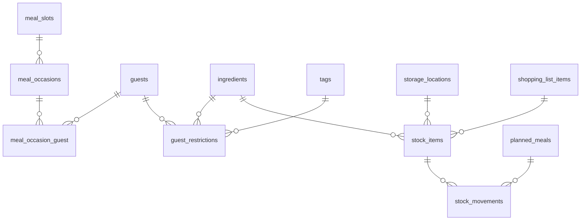

# 05 — Évolutions : convives, stock, suggestions et péremption

Ce document complète [02-fonctionnalites.md](02-fonctionnalites.md) (modules 0 à 7, règles R1 à R6).
Il décrit quatre nouveaux modules, les règles de gestion R7 à R12, les ajouts au modèle de données
et le découpage en lots 6 à 11.

| Module | Besoin | Lots |
|---|---|---|
| **8 — Convives & invités** | Planifier un repas à plus de 2, avec des invités, leurs contraintes et leur historique | 6 |
| **9 — Stock (garde-manger)** | Savoir ce qu'on a au frigo, au congélateur et au placard, sans saisie fastidieuse | 7, 9 |
| **10 — Suggestions depuis le stock** ✅ ([détail](lots/lot-10-suggestions.md)) | « Que peut-on cuisiner avec ce qu'on a ? », en priorité ce qui périme bientôt | 10 |
| **11 — Péremption & alertes** | Voir à temps ce qui doit être mangé, congelé ou jeté | 8 |

Vocabulaire : un **lot** désigne toujours une étape de développement ; un produit rangé dans le frigo est un **article en stock**.

Marqueurs : **[Lot n]** = prévu dans le lot indiqué · **[Plus tard]** = idée gardée pour le lot 11 (V2) ou au-delà.

> **Principe directeur** : le stock n'est utile que s'il reste à jour. Chaque fonctionnalité est pensée pour
> réduire la saisie : valeurs par défaut par ingrédient, rangement des courses en un écran, déduction
> automatique quand un repas est mangé, et un mode « présence » (on en a / on n'en a plus) pour tout ce
> qui ne mérite pas d'être pesé.

---

## Module 8 — Convives & invités

Aujourd'hui, chaque repas suppose le foyer complet (`BOUFFE_HOUSEHOLD_SIZE`, 2) : c'est ce nombre qui
sert de portions par défaut et qui est retiré des portions cuisinées pour calculer les restes. Ce module
rend le nombre de convives **propre à chaque repas** (date + créneau).

### 8.1 Convives d'un repas [Lot 6]

Depuis une case du planning, bouton **👥 Convives** :

| Champ | Détail |
|---|---|
| Membres du foyer présents | cases à cocher par compte (Pierre ☑ Monique ☑) — permet aussi « Monique absente ce midi » |
| Invités connus | choisis dans le carnet d'invités (8.4), création à la volée |
| Invités sans nom | compteur adultes **+ n** et enfants **+ n** |
| Occasion | texte libre : « Anniversaire de Julie », « Dimanche en famille » |
| Note | « Paul apporte le dessert » |

- Sans saisie, le repas garde le comportement actuel : foyer complet, aucun invité.
- La case affiche le total : **👥 6** et l'occasion en infobulle ; l'en-tête de semaine indique « 2 repas avec invités ».
- Sur mobile, le badge reste visible dans la carte du jour.

### 8.2 Portions [Lot 6]

- Le nombre de **portions à prévoir** d'un repas = convives pondérés (règle R7) ; c'est la valeur proposée quand on ajoute une recette dans ce créneau.
- Si on modifie les convives **après** avoir planifié des plats : « Adapter les portions des 2 plats de ce repas (2 → 6) ? » [Oui] [Non].
- Les portions restent modifiables plat par plat (ex. plat pour 8 afin d'avoir des restes, dessert pour 6).
- La liste de courses n'a rien de spécial à faire : elle suit déjà les portions (R1). La provenance affiche « Lasagnes — dim. midi, 6 convives ».

### 8.3 Restes avec invités [Lot 6]

- Les portions mangées au repas = convives pondérés du repas (et non plus la taille du foyer).
- Exemple : lasagnes pour 8, repas à 6 → **2 portions de restes** ; l'assistant propose de les placer.
- Un repas « restes » placé sur un créneau sans invités prend par défaut les portions du foyer présent.

### 8.4 Carnet d'invités [Lot 6]

Menu **Invités** (sous-menu du planning sur mobile) :

| Champ | Détail |
|---|---|
| Nom | obligatoire (« Julie », « Parents de Monique ») |
| Groupe | Famille, Amis, Collègues… (liste libre) |
| Enfant | case à cocher → compte comme une demi-portion (réglable) |
| Contraintes alimentaires | voir 8.5 |
| Notes | « aime le vin rouge », « ne mange pas épicé » |
| Archivé | masqué des choix mais historique conservé |

- Un **groupe d'invités** peut être ajouté d'un coup (« Famille Van… » = 4 personnes). [Lot 6]
- Fiche invité : contraintes, **historique des repas partagés** (date, plats servis, occasion).

### 8.5 Contraintes alimentaires et alertes [Lot 6]

Chaque invité peut avoir :

| Type | Lien | Niveau d'alerte |
|---|---|---|
| **Allergie / intolérance** | un ou plusieurs ingrédients | 🔴 rouge, en tête du sélecteur de recette |
| **N'aime pas** | un ou plusieurs ingrédients | 🟠 orange |
| **Régime** | un tag de recette requis (ex. « Végétarien ») | 🟠 orange si la recette n'a pas le tag |

- Dans le **sélecteur de recette** d'un repas avec invités : badges sur les recettes (« Contient : noix — allergie de Julie »), filtre **« Compatibles avec les convives »**.
- Sur la **case du planning** : ⚠ si un plat planifié entre en conflit avec un invité ajouté ensuite.
- Sur la **fiche recette** ouverte depuis un repas : lignes d'ingrédients concernées surlignées.
- Les alertes **n'empêchent jamais** de planifier (décision de Q10 à confirmer).

> ⚠ **Limite importante** : la détection se fait **sur les ingrédients saisis dans la recette**.
> Un allergène caché dans un produit transformé (pesto → pignons, bouillon → céleri) ou une trace
> n'est pas détecté. L'écran le rappelle en une ligne pour les allergies.

### 8.6 « Déjà servi » [Lot 6]

- Dans le sélecteur, pour un repas avec invités connus : « Déjà servi à Julie le 12 mars 2026 » sur les recettes concernées, tri possible **« Jamais servi à ces invités »**.
- Sur la fiche invité : liste des plats servis, du plus récent au plus ancien.

### 8.7 Repas de réception [Lot 6 / Plus tard]

- **Vue du repas** (clic sur l'occasion) : convives, contraintes, plats du créneau dans l'ordre, portions, notes. [Lot 6]
- Bouton **« Liste de courses pour ce repas »** : ouvre la génération avec uniquement les plats de ce créneau cochés. [Lot 6]
- **Impression du menu** (carte simple : occasion, date, plats). [Plus tard]
- **Rétroplanning de préparation** à partir des temps de préparation / cuisson / repos et de l'heure de service (« commencer le gâteau à 15 h 30 »). [Plus tard]

---

## Module 9 — Stock (garde-manger)

### 9.1 Emplacements [Lot 7]

- Liste pré-remplie, ordre et nom modifiables : **Réfrigérateur**, **Congélateur**, **Placard**, **Cave / cellier**, **Corbeille à fruits**.
- Type d'emplacement : `frais`, `congélation`, `ambiant` → utilisé pour les durées de conservation (module 11).

### 9.2 Paramètres de stock d'un ingrédient [Lot 7]

Ajoutés à la fiche ingrédient (Paramètres → Ingrédients), avec **valeurs par défaut pré-remplies** pour les 154 ingrédients fournis :

| Champ | Exemple | Utilité |
|---|---|---|
| Mode de suivi | `non suivi` / `présence` / `quantité` | sel = présence, poulet = quantité, eau du robinet = non suivi |
| Emplacement habituel | Réfrigérateur | pré-remplissage |
| Conservation par défaut | 3 jours, DLC | date proposée au rangement |
| Conservation après ouverture | 3 jours | crème, lait, sauce tomate |
| Congelable / durée au congélateur | oui, 3 mois | action « Congeler » |
| Stock minimum | 1 (présence) ou 500 g | ajout automatique à la liste (9.10) |

Proposition de départ : **produits de base → présence**, **frais (crèmerie, boucherie, fruits & légumes) → quantité**, **épicerie → présence**. Modifiable ingrédient par ingrédient.

### 9.3 Article en stock [Lot 7]

Un ingrédient peut avoir **plusieurs articles en stock** (deux paquets de beurre avec des dates différentes).

| Champ | Détail |
|---|---|
| Ingrédient **ou** plat préparé | plat préparé = libellé libre (« Restes de lasagnes », « Sauce bolognaise maison ») |
| Quantité + unité | facultative : vide = « en stock, quantité inconnue » |
| Emplacement | pré-rempli depuis l'ingrédient |
| Date limite + type | DLC / DDM / aucune (voir 11.1) |
| Ouvert le | date, facultatif |
| Congelé le | date, facultatif |
| Note | « entamé », « pour le gâteau de dimanche » |
| Ajouté par / le | traçabilité |

### 9.4 Écran Stock [Lot 7]

- Onglets par **emplacement** + onglet « Tout » ; lignes groupées par ingrédient : « Tomates — 2 articles · 1,2 kg » dépliable.
- Chaque article : quantité formatée (R3), badge de date (J-2, couleur selon R11), pictos « ouvert », « congelé ».
- Recherche instantanée et filtres : **à consommer bientôt**, **date dépassée**, **ouverts**, **sous le minimum**.
- Mode présence affiché en simple interrupteur : **Sel ● en stock**.
- Mobile d'abord : utilisable debout devant le frigo (l'accès téléphone du lot 5 est un prérequis).

### 9.5 Ajout rapide [Lot 7]

- Champ unique, comme la liste de courses : « 2 kg de pommes de terre », « 6 œufs », « crème fraîche » (QuantityParser + reconnaissance d'ingrédient existants).
- Emplacement et date **pré-remplis** depuis l'ingrédient ; raccourcis de date : **+3 j**, **+1 sem.**, **+1 mois**, **date précise**, **pas de date**.
- Ajout d'un **plat préparé** (restes, batch cooking) avec emplacement et date (+3 j au frigo par défaut).

### 9.6 Ranger les courses [Lot 7]

Bouton **« Ranger dans le stock »** sur une liste de courses (proposé aussi au moment de la marquer terminée) :

- Un seul écran avec les articles **cochés et pas encore rangés** : quantité achetée pré-remplie (quantité de la liste), emplacement, date proposée.
- Pour chaque ligne : modifier la quantité (paquet de 500 g au lieu de 400 g), la date, ou **ignorer** (lessive, articles sans ingrédient ignorés par défaut).
- **Tout valider** en un clic ; les articles rangés sont marqués pour ne pas être rangés deux fois.
- Ingrédients en mode présence : simplement « en stock ».

### 9.7 Consommer, ajuster, jeter [Lot 7]

Actions sur un article en stock (menu de la ligne, grands boutons sur mobile) :

| Action | Effet |
|---|---|
| **Terminé** | article retiré (mouvement « consommé ») |
| **Il en reste ¾ · ½ · ¼** | quantité recalculée ; si quantité inconnue, note « entamé » |
| **Quantité exacte** | saisie |
| **Ouvert** | date d'ouverture = aujourd'hui → nouvelle date effective (R11) |
| **Congeler / Décongeler** | emplacement + dates mises à jour (R11) |
| **Déplacer** | autre emplacement |
| **Jeté** | article retiré avec une raison : périmé, abîmé, autre (statistiques anti-gaspi) |

Mode présence : **« Plus rien »** → proposition « Ajouter à la liste de courses en cours ? ».

Chaque action crée un **mouvement de stock** (historique, annulation de la dernière action pendant quelques secondes).

### 9.8 Déduction quand un repas est mangé [Lot 9]

Quand on coche **« mangé ✓ »** sur un repas « recette » :

- Fenêtre de confirmation : « Retirer du stock ? » avec les lignes calculées (R9) : *Oignons −2 (reste 1)*, *Crème −20 cl (reste 0 → terminé)*, *Riz : quantité inconnue, laisser en stock ?*.
- Chaque ligne est modifiable ou décochable ; bouton **Ne rien retirer**.
- Réglage (Paramètres → Stock) : **Demander** (défaut) / **Automatique** / **Jamais**.
- Décocher « mangé » propose d'**annuler la déduction** (mouvements inverses).
- Repas « restes » : rien à déduire des ingrédients ; si un plat préparé correspondant est en stock, proposition de le retirer.
- **Restes au frigo** : si le repas a des restes (R7), proposition « Mettre 2 portions de lasagnes au réfrigérateur (jusqu'au 19/09) ? » → plat préparé en stock, lié au repas d'origine.

### 9.9 Liste de courses tenant compte du stock [Lot 9]

- Case **« Déduire ce qui est en stock »** (cochée par défaut) dans la fenêtre de génération.
- Calcul selon R8 : besoin − stock disponible à la date du repas.
- Sur la liste :
  - article entièrement couvert → section repliable **« Déjà en stock »** (« Crème : besoin 20 cl, en stock 40 cl ») avec **« Acheter quand même »** ;
  - article partiellement couvert → quantité réduite, provenance « besoin 600 g − en stock 200 g » ;
  - produits de base en mode présence : en stock → affichés « ✓ en stock » dans « À vérifier dans le placard » ; plus en stock → basculés dans la liste normale.
- Avertissement quand un article périme avant le repas qui l'utilise : « Crème fraîche : périme le 18/09, prévue le 20/09 — non comptée ».
- La régénération (4.3) recalcule avec le stock du moment ; les articles déjà cochés restent cochés, pour ne pas les faire racheter parce qu'ils ne sont pas encore rangés.

### 9.10 Stock minimum [Lot 9]

- Un ingrédient sous son **stock minimum** (ou « plus rien » en mode présence) est ajouté à la prochaine liste générée avec l'origine **« Stock bas »**.
- Complète les articles récurrents : on peut remplacer « Lait chaque semaine » par « Lait : minimum 1 l ».
- Filtre « sous le minimum » dans l'écran Stock + bouton « Ajouter à la liste en cours ».

### 9.11 Inventaire [Lot 9]

- **Mode inventaire** par emplacement : une carte par article, trois boutons **✓ Toujours là** · **Quantité** · **✗ Plus là**.
- Date du dernier inventaire affichée par emplacement (« Placard : inventaire il y a 2 mois »).

### 9.12 Historique et anti-gaspillage [Plus tard]

- Historique des mouvements filtrable (ingrédient, type, période).
- Statistiques : produits jetés par mois, ingrédients les plus jetés, part consommée avant la date.

### 9.13 Scan de code-barres [Plus tard]

- Lecture du code-barres avec la caméra du téléphone et récupération du nom via **Open Food Facts**.
- Nécessite **HTTPS** (la caméra est bloquée par les navigateurs en `http://` sur le réseau local) et un accès Internet : pertinent après un hébergement OVH ou un certificat local.

---

## Module 10 — Suggestions de recettes depuis le stock

### 10.1 Écran « Que cuisiner ? » [Lot 10]

Accessible depuis le menu Stock, le tableau de bord et un nouvel onglet **« Avec mon stock »** du sélecteur de repas du planning.

- Paramètres en haut : **portions** (convives du créneau visé, sinon foyer), **tags**, **temps total max**, **doit utiliser** (un ou plusieurs ingrédients / plats préparés : mode « vider le frigo »).
- Résultats en trois groupes :
  1. **Faisable tout de suite** — tous les ingrédients nécessaires sont disponibles ;
  2. **Presque** — il manque 1 ou 2 ingrédients, listés (« manque : crème fraîche 20 cl ») ;
  3. les autres recettes sont masquées (lien « voir tout »).
- Dans chaque groupe, tri par **score** (R10) : en premier les recettes qui utilisent ce qui périme bientôt.
- Chaque carte : photo, titre, temps, couverture (« 7/8 ingrédients »), badge **♻ utilise 2 produits à consommer vite**.

### 10.2 Actions [Lot 10]

- **Planifier** (date et créneau pré-remplis si on vient du planning).
- **Ajouter les manquants à la liste de courses** en cours (ou nouvelle liste).
- **Voir la recette** : chaque ligne d'ingrédient porte un badge **✓ en stock**, **◐ partiel (manque 200 g)**, **✗ manquant**, **? à vérifier**.

### 10.3 Réservations du planning [Lot 10]

- Par défaut, le stock déjà **promis à des repas planifiés** dans les 7 prochains jours n'est pas proposé (sinon on suggère de manger ce soir le poulet prévu pour jeudi).
- Interrupteur **« Ignorer le planning »** pour voir tout le stock.

### 10.4 Tableau de bord [Lot 10]

- Carte **« À utiliser rapidement »** : 3 produits qui périment bientôt → « 4 recettes possibles » (lien vers 10.1 avec « doit utiliser » pré-rempli).

### 10.5 Remplir la semaine depuis le stock [Plus tard]

- Variante du remplissage automatique (V2) qui privilégie les recettes à forte couverture et anti-gaspi.

---

## Module 11 — Péremption & alertes

### 11.1 Types de dates [Lot 7]

| Type | Mention sur l'emballage | Signification | Après la date |
|---|---|---|---|
| **DLC** | « À consommer jusqu'au » | produits frais, date impérative | 🔴 à jeter |
| **DDM** | « À consommer de préférence avant » | qualité, pas de risque sanitaire | 🟡 encore consommable, à vérifier |
| **Aucune** | fruits, légumes en vrac, plats maison | date proposée depuis l'ingrédient ou vide | — |

### 11.2 Date effective [Lot 8]

La date qui compte pour les alertes est calculée (R11) à partir de la date imprimée, de l'ouverture et de la congélation :
*crème fraîche DLC 30/09, ouverte le 16/09, 3 jours après ouverture → à consommer avant le 19/09*.

### 11.3 Niveaux d'alerte [Lot 8]

| Niveau | Condition par défaut | Couleur |
|---|---|---|
| **Dépassée** | DLC effective < aujourd'hui | rouge plein « à jeter » |
| **Aujourd'hui / demain** | DLC effective ≤ J+1 | rouge |
| **Bientôt** | DLC ≤ J+3, ou DDM ≤ J+7 | orange |
| **DDM dépassée** | DDM < aujourd'hui | jaune « à vérifier » |
| OK | le reste | neutre |

Seuils réglables dans **Paramètres → Stock**.

### 11.4 Où apparaissent les alertes [Lot 8]

- **Badge** avec le nombre de produits urgents sur le menu **Stock** (toutes les pages).
- **Tableau de bord** : carte « À consommer rapidement », triée par date, avec actions directes.
- **Planning** : bandeau « 3 produits périment avant jeudi » (lien vers les suggestions à partir du lot 10).
- **Liste de courses** : avertissements de 9.9.
- Pas de notification sur le téléphone tant que l'application n'est ni en HTTPS ni installée en PWA ; un **e-mail récapitulatif** est envisageable après hébergement. [Plus tard]

### 11.5 Actions depuis une alerte [Lot 8]

**Consommé** · **Jeté** (raison) · **Congeler** (si congelable) · **Nouvelle date** · **Ouvert** · et à partir du lot 10 **Trouver une recette** (suggestions avec « doit utiliser » pré-rempli).

---

## Règles de gestion

### R7 — Convives, portions et restes

- `convives_pondérés = membres du foyer présents + invités adultes + (invités enfants × 0,5)`, arrondi à l'entier supérieur. Le facteur enfant est réglable.
- Sans convives saisis : `convives_pondérés = BOUFFE_HOUSEHOLD_SIZE` (comportement actuel).
- Portions proposées pour un plat = `convives_pondérés` du créneau.
- `restes_disponibles = portions_cuisinées − min(portions_cuisinées, convives_pondérés) − restes_déjà_placés` (remplace la taille du foyer dans la règle du lot 3).
- Modifier les convives ne modifie jamais les portions sans confirmation.
- Déplacer un plat vers un autre créneau : ses portions ne changent pas ; l'alerte de restes est recalculée avec les convives du nouveau créneau.

### R8 — Stock dans la liste de courses

Pour chaque ingrédient de la liste (après R1/R2) :

1. **Stock disponible** = somme des articles en stock de l'ingrédient dont la date effective (R11) est ≥ date du **premier** repas qui l'utilise, hors plats préparés.
2. Conversion dans l'unité de base de la ligne (g, ml, pièces) avec `UnitConverter` et le poids moyen par pièce (même logique que R2).
3. `à_acheter = max(0, besoin − stock_disponible)`.
4. Unités non comparables (besoin en g, stock en « boîte ») ou quantité de stock inconnue : **rien n'est déduit**, la ligne indique « en stock : 1 boîte — vérifier ».
5. Mode présence : en stock → considéré couvert ; plus en stock → à acheter.
6. Les quantités sont arrondies à l'affichage seulement (R3) ; la provenance conserve besoin et stock déduit.
7. Le stock n'est pas réservé entre deux listes : la liste est un instantané, comme en 4.1.

### R9 — Déduction du stock

- Besoin d'un repas mangé = lignes non optionnelles de la recette mises à l'échelle (R1). Les lignes optionnelles sont proposées décochées.
- Retrait **FEFO** (*first expired, first out*) : les articles dont la date effective est la plus proche sont vidés d'abord ; articles sans date en dernier.
- Conversions comme R8 ; si non convertible ou quantité inconnue : proposition « laisser en stock » ou « marquer terminé ».
- Quantité restante ≤ 2 % de la quantité initiale ou < 1 pièce → article proposé comme **terminé**.
- Chaque retrait crée un mouvement lié au repas ; annuler « mangé » propose les mouvements inverses.
- Ingrédients en mode **non suivi** : ignorés ; en mode **présence** : jamais retirés automatiquement (on ne sait pas si c'était le dernier).

### R10 — Score de suggestion

Pour chaque recette active, mise à l'échelle au nombre de portions demandé :

- Lignes prises en compte : non optionnelles ; les **produits de base non suivis** sont réputés disponibles.
- Statut d'une ligne : **disponible** (stock suffisant, ou quantité inconnue / non comparable → « ? »), **partiel**, **manquant**. Le stock réservé par le planning (10.3) est retiré avant calcul.
- `couverture = lignes disponibles / lignes prises en compte` ; une ligne partielle compte pour 0,5.
- Score :
  - `+ 100 × couverture`
  - `+ bonus anti-gaspi` par article en stock utilisé : +15 si date effective ≤ J+2, +8 si ≤ J+5 ; +20 si un « doit utiliser » est présent ; bonus total plafonné à 40
  - `− 20` si la recette a été mangée dans les 14 derniers jours
  - `+ 5` si favorite, `+ 5` si note moyenne ≥ 4
- Groupes : *Faisable* = aucune ligne manquante ni partielle ; *Presque* = 1 ou 2 lignes manquantes ou partielles **et au moins la moitié des ingrédients disponibles** (précision du lot 10).
- Avec « doit utiliser », seules les recettes contenant au moins un des ingrédients choisis sont retenues.

### R11 — Date effective et niveau d'alerte

- `date_effective = min(date_imprimée, ouvert_le + conservation_après_ouverture)` (termes absents ignorés).
- Congelé : `date_effective = congelé_le + durée_congélation` (la date imprimée ne s'applique plus) ; type ramené à DDM.
- Décongelé : `date_effective = décongelé_le + 1 jour`, type DLC, emplacement Réfrigérateur.
- Plat préparé sans date : `ajouté_le + 3 jours` au réfrigérateur, `+ 3 mois` au congélateur.
- Niveau calculé selon 11.3 à partir de la date du jour ; aucun stockage du niveau (toujours recalculé).

### R12 — Intégrité (complète R6)

- Un ingrédient présent en stock ne peut pas être supprimé ; un emplacement contenant des articles non plus (déplacer d'abord).
- Un invité ayant participé à un repas est **archivé** au lieu d'être supprimé (historique conservé).
- Supprimer un repas planifié conserve ses mouvements de stock (le lien devient vide) ; les convives du créneau sont conservés (on peut inviter avant de choisir le menu). « Vider la semaine » propose aussi de retirer les convives.
- Les mouvements de stock ne sont jamais modifiés : une correction crée un mouvement d'ajustement.

---

## Modèle de données (ajouts)

Conventions identiques à [03-modele-donnees.md](03-modele-donnees.md) : enums en `VARCHAR` validés par des enums PHP, clés étrangères explicites.

### Convives (lot 6)

**`meal_occasions`** — un enregistrement par date + créneau ayant des convives particuliers
| Colonne | Type | Notes |
|---|---|---|
| date | DATE | |
| meal_slot_id | FK → meal_slots | RESTRICT |
| title | VARCHAR(150) NULL | occasion |
| absent_user_ids | JSON NULL | membres du foyer absents |
| extra_adults / extra_children | TINYINT UNSIGNED | invités sans nom |
| notes | VARCHAR(255) NULL | |
| UNIQUE(date, meal_slot_id) | | |

**`guests`**
| Colonne | Type | Notes |
|---|---|---|
| name | VARCHAR(100) | |
| group_name | VARCHAR(50) NULL | Famille, Amis… |
| is_child | BOOLEAN | demi-portion |
| notes | TEXT NULL | |
| archived_at | TIMESTAMP NULL | |

**`meal_occasion_guest`** : meal_occasion_id (CASCADE), guest_id (RESTRICT), clé primaire composée.

**`guest_restrictions`**
| Colonne | Type | Notes |
|---|---|---|
| guest_id | FK → guests | CASCADE |
| type | ENUM('allergy','dislike','diet') | |
| ingredient_id | FK → ingredients NULL | allergy / dislike |
| tag_id | FK → tags NULL | diet (tag requis) |
| note | VARCHAR(150) NULL | « même en traces » |

> Réalisé au lot 6 : groupes gérés par la colonne `guests.group_name` (pas de table `guest_groups`) ; facteur enfant dans `.env` (`BOUFFE_CHILD_PORTION`) ; colonne `servings` ajoutée à `shopping_list_item_sources`.

### Stock (lots 7 à 9)

**`storage_locations`** : name, type ENUM('fresh','freezer','ambient'), sort_order, last_inventory_at.

**`ingredients`** (colonnes ajoutées)
| Colonne | Type | Notes |
|---|---|---|
| stock_mode | ENUM('none','presence','quantity') | défaut selon rayon (seeder) |
| storage_location_id | FK → storage_locations NULL | emplacement habituel |
| shelf_life_days | SMALLINT NULL | conservation par défaut |
| shelf_life_type | ENUM('dlc','ddm','none') | |
| days_after_opening | SMALLINT NULL | |
| freezer_months | TINYINT NULL | NULL = non congelable |
| min_stock_quantity | DECIMAL(12,3) NULL | |
| min_stock_unit_id | FK → units NULL | |

**`stock_items`** (articles en stock)
| Colonne | Type | Notes |
|---|---|---|
| ingredient_id | FK → ingredients NULL | RESTRICT ; NULL = plat préparé |
| label | VARCHAR(150) NULL | plat préparé |
| planned_meal_id | FK → planned_meals NULL | restes d'un repas (SET NULL) |
| quantity | DECIMAL(12,3) NULL | NULL = quantité inconnue |
| initial_quantity | DECIMAL(12,3) NULL | pour « il en reste ½ » et R9 |
| unit_id | FK → units NULL | |
| is_present | BOOLEAN | mode présence |
| storage_location_id | FK → storage_locations | RESTRICT |
| expires_on | DATE NULL | date imprimée ou proposée |
| expiry_type | ENUM('dlc','ddm','none') | |
| opened_on / frozen_on / thawed_on | DATE NULL | R11 |
| shopping_list_item_id | FK → shopping_list_items NULL | rangé depuis une liste (SET NULL) |
| note | VARCHAR(255) NULL | |
| created_by | FK → users NULL | |

**`stock_movements`**
| Colonne | Type | Notes |
|---|---|---|
| stock_item_id | FK → stock_items NULL | SET NULL (article terminé puis purgé) |
| ingredient_id | FK → ingredients NULL | copié |
| label | VARCHAR(150) | copié |
| type | ENUM('in','consume','waste','adjust','move','freeze','thaw','open') | |
| quantity / unit_id | | variation (négative en sortie) |
| reason | VARCHAR(50) NULL | périmé, abîmé… |
| planned_meal_id | FK → planned_meals NULL | déduction R9 |
| shopping_list_id | FK → shopping_lists NULL | rangement |
| user_id | FK → users NULL | |
| created_at | TIMESTAMP | pas de modification (R12) |

> Réalisé au lot 7 : colonne `stock_items.finished_at` (article terminé masqué, conservé pour l'annulation) ; colonnes `stock_movements.snapshot` et `reverts_movement_id`, type de mouvement `undo` ; `stock_deducted` reporté au lot 9.
>
> Réalisé au lot 9 : `shopping_lists.deduct_stock` ; `shopping_list_items.stock_status` (covered · partial · out), `stock_deducted`, `stock_note`, `buy_anyway` ; origine d'article `restock` (« Stock bas ») ; unité `portion` pour les restes ; réglage `stock.deduction_mode` (ask · auto · never).

**`shopping_list_items`** (colonnes ajoutées) : `stocked_at` TIMESTAMP NULL (9.6), `stock_deducted` DECIMAL(12,3) NULL (R8) ; nouvelle origine `restock` (9.10).

**`planned_meals`** : aucune colonne ajoutée ; les convives sont lus dans `meal_occasions` par date + créneau.

**`settings`** (clé / valeur, créée au lot 8) : mode de déduction et seuils d'alerte (lots 8 et 9). Les valeurs du fichier `.env` restent les valeurs par défaut.

---

## Écrans et routes prévus

| URL | Écran | Lot |
|---|---|---|
| `/invites`, `/invites/{id}` | Carnet et fiche invité | 6 |
| *(fenêtre)* planning → 👥 Convives, vue du repas | `Planner\Occasion` | 6 |
| `/stock?emplacement=` | Stock | 7 |
| `/courses/{id}/ranger` | Ranger les courses | 7 |
| `/parametres/emplacements`, `/parametres/stock` | Emplacements, réglages stock et alertes | 7, 8 |
| `/stock/inventaire/{emplacement}` | Inventaire | 9 |
| `/que-cuisiner` | Suggestions | 10 |

Services envisagés : `OccasionService` (R7), `StockService` (mouvements, FEFO), `StockQuantityComparer` (conversions communes R8/R9/R10), `ExpiryCalculator` (R11), `StockDeductionPlanner` (R9), `StockAwareShoppingListGenerator` ou option du générateur actuel (R8), `RecipeSuggester` (R10).

---

## Découpage en lots

Le **lot 5 (Finitions MVP)** reste le prochain : la sauvegarde protège les données avant d'ajouter des tables, et l'accès depuis les téléphones est indispensable pour utiliser le stock devant le frigo.

| Lot | Contenu | Livrable | Taille |
|---|---|---|---|
| **5 — Finitions MVP** ✅ | Sauvegarde (`bouffe:backup` + bouton), accès téléphone sur le réseau local, polissage UX | Version 1.0 | M |
| **6 — Convives & invités** ✅ ([détail](lots/lot-6-convives-invites.md)) | 8.1 à 8.7 (sauf [Plus tard]), R7, carnet d'invités, contraintes et alertes, « déjà servi », restes recalculés | Planifier un repas à 6 avec restes justes et alertes allergies | M |
| **7 — Stock : saisie et consultation** ✅ ([détail](lots/lot-7-stock.md)) | Emplacements, paramètres stock des ingrédients (+ valeurs par défaut des 154 ingrédients), articles en stock, écran Stock, ajout rapide, ranger les courses, consommer / ajuster / jeter / ouvrir / congeler, mode présence, types de date (11.1), mouvements | Stock tenu à jour à la main et au retour des courses | L |
| **8 — Péremption & alertes** ✅ ([détail](lots/lot-8-peremption-alertes.md)) | R11, niveaux et seuils, badge de menu, carte du tableau de bord, bandeau planning, actions depuis l'alerte | Plus de produit oublié au fond du frigo | S |
| **9 — Stock ↔ planning & courses** ✅ ([détail](lots/lot-9-stock-planning-courses.md)) | Déduction au « mangé » (R9) et annulation, restes au frigo, liste de courses qui déduit le stock (R8), stock minimum, inventaire | Le stock se met à jour presque seul ; on n'achète plus ce qu'on a | L |
| **10 — Suggestions depuis le stock** | R10, écran « Que cuisiner ? », onglet du sélecteur de repas, disponibilité sur la fiche recette, réservations du planning, carte « À utiliser rapidement » | Idées de repas qui vident le frigo | M |
| **11 — V2** → détaillée dans [06-version-2.md](06-version-2.md) (lots 11 à 20) | Import URL schema.org, mode cuisine, remplissage aléatoire (+ depuis le stock), semaines types, saisons, coût, PWA et notifications, scan code-barres, statistiques anti-gaspi, impression du menu et rétroplanning de réception | Itérations | — |

Taille : S ≈ lot 4 divisé par deux, M ≈ lot 3, L ≈ lot 4.

**Dépendances** : 6 est indépendant du stock (peut être avancé ou reporté) · 8 nécessite 7 · 9 nécessite 7 (et profite de 8) · 10 nécessite 7, donne de meilleurs résultats après 9.

Chaque lot suit la même démarche que les précédents : services et règles testés d'abord, écrans ensuite, vérification sous SQLite et MariaDB, parcours navigateur ordinateur / tablette / mobile, document `docs/lots/lot-n-….md`.

---

## Questions ouvertes

Comme pour le document 04 : réponds directement dans la colonne de droite, les propositions par défaut seront appliquées sinon.

| # | Question | Proposition par défaut |
|---|---|---|
| Q8 | Ordre des lots : convives d'abord (6), ou stock en premier (7 à 10) puis convives ? | Lot 5, puis 6, puis 7 → 10 |
| Q9 | Suivi du stock par défaut : quantités pour le frais, simple présence pour l'épicerie et les produits de base — ça te convient ? | Oui |
| Q10 | Allergie d'un invité : simple alerte rouge, ou empêcher de planifier la recette ? | Alerte rouge, jamais bloquant |
| Q11 | Enfants comptés comme une demi-portion ? | Oui, facteur réglable |
| Q12 | Quand un repas est coché « mangé » : demander avant de retirer du stock, ou retirer automatiquement ? | Demander |
| Q13 | Seuils d'alerte : DLC à J-3, DDM à J-7 ? | Oui, réglables |
| Q14 | Suivre aussi les plats maison (restes, batch cooking au congélateur) dans le stock ? | Oui (plats préparés) |
| Q15 | Scan de code-barres important dès le lot 7 ? (nécessite HTTPS + Internet) | Non, lot 11 |
